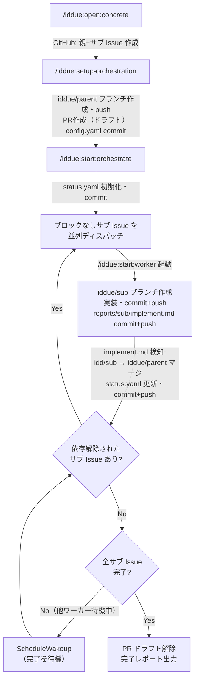

# 全体ワークフロー

スキルの呼び出し順と、各呼び出しによる状態変化を示す。

---

## スキルと状態変化

### STAGE 1: 設計フェーズ

| スキル | 状態変化 |
|--------|---------|
| `/iddue:open:concrete` | GitHub: 親 Issue + サブ Issue を起票 |
| `/iddue:setup-orchestration {parent}` | ブランチ: `iddue/{parent}` 作成・push PR: `iddue/{parent}` → develop（ドラフト）作成 `.orchestrate/config.yaml` 生成・commit 各サブ Issue YAML: `parent.linked_pr.branch` をセット |

### STAGE 2: 実装フェーズ

| スキル / タイミング | 状態変化 |
|-------------------|---------|
| `/iddue:start:orchestrate`（初回起動） | `.orchestrate/status.yaml` 初期化・commit+push ブロックなしサブ Issue を並列ディスパッチ |
| `/iddue:start:worker {sub}` | ブランチ: `iddue/{sub}` 作成（base: `iddue/{parent}`） 実装完了後 `iddue/{sub}` に commit+push `.orchestrate/reports/{sub}/implement.md` commit+push |
| implement.md 検知後（orchestrate） | `iddue/{sub}` → `iddue/{parent}` マージ `status.yaml` 更新・commit+push コンフリクト発生時は `reports/{sub}/conflict.md` も追加 依存解除されたサブ Issue があれば次ワーカーをディスパッチ |
| 全サブ Issue 完了（orchestrate） | PR をドラフト解除・完了レポート出力 |

---

## フロー図

